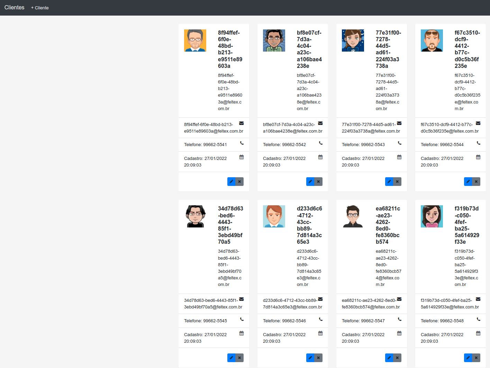

# ClienteUi

  Este projeto realiza o cadastro de Clientes em uma base de dados MySQL. O projeto é desenvolvido em [Angular](https://github.com/feltex/cliente-ui)
e consume uma API desenvolvida em [Java](https://github.com/feltex/cliente-api)


  
  
  
  
## Vídeo da API


 - [Cliente API](https://github.com/feltex/cliente-api)


## Pré Requisitos

 - Angular 12
 - UI: Código no GitHub Angular [Feltex](https://github.com/feltex/cliente-ui)
 - API: Código no GitHub API Java com Spring Boot [Feltex](https://github.com/feltex/cliente-api)
 - [MySQL](https://www.mysql.com/)
 - [Docker](https://www.docker.com/) 
 - [Docker Compose](https://docs.docker.com/compose/install/)  


## Criar imagem Docker

    docker build -t <usuario>/cliente-ui:V1  .

    docker push <usuario>/cliente-ui:V1


## Executando o projeto

```
    ng serve 
```

## Utilizando a aplicação

```
  http://localhost:4200/  
``` 

